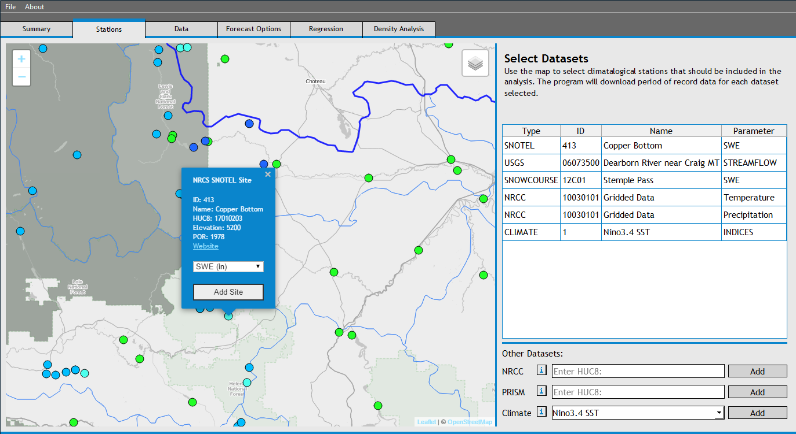
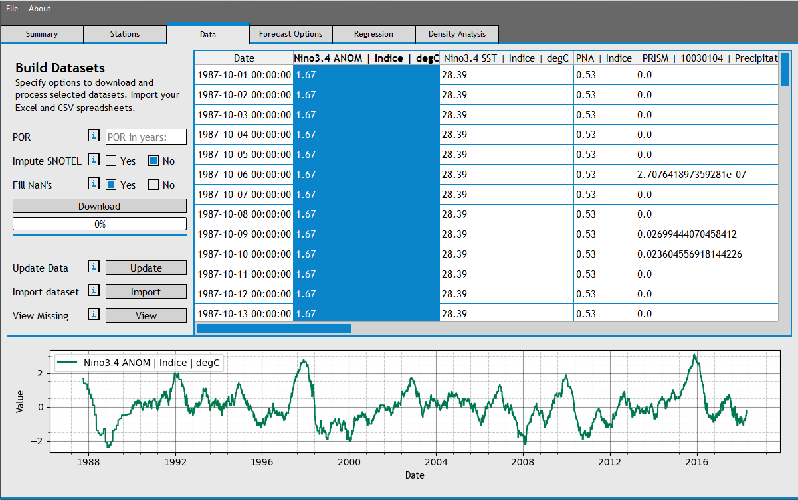
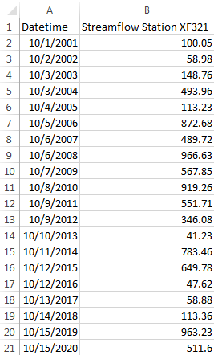
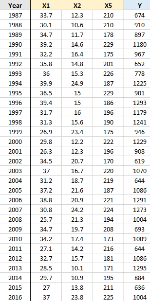
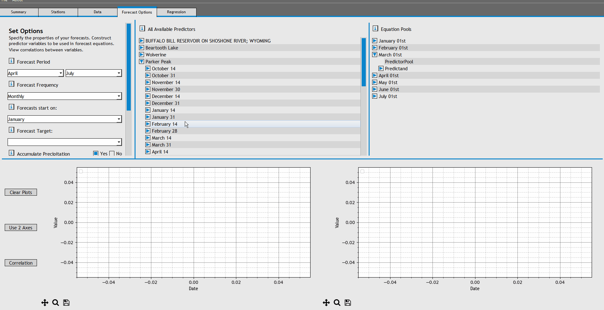

### Version 2.0 Beta

Develop and analyze high-performing seasonal streamflow forecasts using PyForecast, developed by Reclamation's Great Plains Region. PyForecast takes advantage of multi-threading and multiple processer cores to analyze thousands of forecasts in minutes using cutting edge statistical techniques. 

## Table of Contents
- [Installation & Updates](#installationandupdates)
- [Overview](#overview)
    - [Summary Tab](#summarytab)
    - [Stations Tab](#stationstab)
    - [Data Tab](#datatab)
    - [Forecast Options Tab](#forecastoptionstab)
    - [Regression Tab](#regressiontab)
    - [Density Analysis Tab](#densityanalysistab)
- [Statistical Methodologies](#statisticalmethodologies)
    - [Parallelized Sequential Selection](#parallelizedsequentialselection)
    - [Multiple Linear Regression](#multiplelinearregression)
    - [Principal Components Regression](#principalcomponentsregression)
    - [Z Score Regression](#zscoreregression)
    - [General Regression Neural Network](#generalregressionneuralnetwork)
    - [Gaussian Process Regression](#gaussianprocessregression)
- [Example Forecast Development](#exampleforecastdevelopment)
- [Appendices](#appendices)
    - [PyForecast Data Loaders](#pyforecastdataloaders)


## Installation and Updates


Not yet written....

## Overview

PyForecast is a statistical modeling tool useful in predicting season inflows and streamflows. The tool collects meterological and hydrologic datasets, analyzes hundreds to thousands of predictor subsets, and returns well-performing statistical regressions between predictors and streamflows. 

Data is collected from web services located at NOAA, RCC-ACIS, NRCS, Reclamation, and USGS servers, and is stored locally on the user’s machine. Data can be updated with current values at any time, allowing the user to make current water-year forecasts using equations developed with the program.

After potential predictor datasets are downloaded and manipulated, the tool allows the user to develop statistically significant regression equations using multiple regression, principal components regression, z-score regression, general regression neural networks, and gaussian process regression. Equations are developed using a combination of paralleled sequential forward selection and cross validation, both described in the Statistical Methodologies section of this document.

### Summary Tab

The Summary Tab displays a summary of the regression equations, predictors, and the forecast point for the user to quickly review equations they’ve developed, as well as view current water year forecasts. 

The Summary tab will populate after the first forecast model is completely developed. To view a completed forecast model, expand the forecast month in the “Chosen Models” table, and choose the equation to view. 

To generate a current water year forecast, right click on the forecast entry and choose "Generate Current Forecast". If an equation contains predictors that are current (e.g. if the current date is March 05th and the user selects a March 01st equation), then the program will generate a current water year forecast based on the data for the current water year, if it exists in the forecast file yet. The current forecast is plotted with it's 90% prediction interval in the plots. 

### Stations Tab

The Stations Tab allows users to locate datasets that may be valuable for their analysis. Users can find SNOTEL stations and snow courses, reservoirs, stream gages, as well as PRISM and NRCC data gridded temperature and precipitation data, and climate indices. 



Stations are found by navigating in the station map to the area of interest and browsing through the station markers. If the user decides that a particular station might be useful in their analysis, they can choose the ‘Add Site’ button in the station pop-up to add the station to the selected datasets table. (Stations can later be removed from the selected datasets table by right-clicking a station and choosing ‘Delete table row’). 

Additionally, watershed-averaged gridded datasets can be downloaded by entering the 8-digit HUC identification number next to the desired gridded dataset in the ‘Other Datasets’ pane and choosing the ‘Add’ button. Only valid HUC’s can be entered. More information on the NRCC gridded dataset can be found at [NRCC's webpage](http://www.nrcc.cornell.edu/). PRISM documentation is located at [PRISM's webpage](http://www.prism.oregonstate.edu/).

Lastly, users can choose to include climate indices in their analysis by selecting the relevant indices next to the ‘Climate’ drop down in the ‘Other Datasets’ pane. Each indice has been shown to be correlated to a particular region's precipitation and streamflow patterns. More information is available at the [Climate Prediction Center](http://www.cpc.ncep.noaa.gov/).

Additional datasets can be added using user-defined dataloaders. To define a new dataloader, use the 'Edit Dataloaders' option in the file menu. After a valid dataloader has been saved, users can add custom datasets using the 'Define Custom Dataset' button. More information on this process can be found in the 'Custom Dataloaders' section of this document's appendix.

### Data Tab

The Data Tab allows users to download, view, update, and import period of record data for stations they selected in the stations tab. 



When the user clicks 'Download' for the first time, daily data is donwloaded for each dataset selected in the stations tab, beginning with the first day of the first water year in the specified POR, and ending with the current day's value. 

Users should note that the program will only download data that is available. For example, if a user specifies a POR of 30 years, and the requested dataset only has 10 years of data, the software will return 20 years of NaN's and 10 years of actual data for that dataset. 

Users can specify whether or not they wish to preprocess data as it is downloaded. Options include:

- Fill NaN's: If any non-SNOTEL (and non-SNOWCOURSE) station has missing data over a period less than 4 days long, cubic splines will be used to interpolate the missing values. See [Pandas documentation](https://pandas.pydata.org/pandas-docs/stable/generated/pandas.Series.interpolate.html) and [Scipy Documentation](https://docs.scipy.org/doc/scipy/reference/tutorial/interpolate.html) for more information.

Users may wish to add their own datasets from excel spreadsheets or CSV files. Formatted datasets with .xlsx and .csv file extensions can be added using the 'Import' button. Spreadsheets should be formatted as follows before they are imported:

- The first row should contain data headers, such as the name of the dataset.
- The remaining rows should contain datetimes (in the first column) and data for the dataset in the second column.

An example spreadsheet might look like this: 



Once the data finished downloading, the Data Table populates. Users can view a data column by clicking on one or more column headers in the data table. 

Additionally, users can also delete columns from the data table, if for some reason the downloaded dataset is not serially complete, or otherwise unusable. To delete a dataset from the data table, right click on the relevant column and choose 'Delete Table Column'. This will also delete the relevant dataset from the station's tab.

### Forecast Options Tab

The Forecast Options Tab allows users to specify the structure and frequency of thier forecast equations. 


To begin the process of generating forecast equations, users should fill out the "Set Options" section and click "Apply Options". At this point the program will begin generating predictors by resampling daily data into monthly and weekly datasets. When finished, the program will display a complete list of predictors in the "All Available Predictors" tree. 

The 'Set Options' pane allows users to specify the specific time periods and frequencies associated with their forecasts for a particular reservoir or stream. 

- Forecast Period: Specify the base the forecast period. For example if you wished to forecast the inflow volume between April and July for a reservoir, you would set the forecast period to 'April' and 'July'. This effectively sets the left hand side of your forecast equations (e.g. Apr-Jul inflow = some equation...). 
- Forecast Frequency: Specify how often you will be generating forecast equations. 'Monthly' will generate one forecast equation per month, and 'Bimonthly' generates 2 forecast equations per month. 
- Forecasts start on: Specify the first forecast date. This is the date when you expect to begin forecasting the streamflow or inflow.
- Forecast Target: Specify which dataset you are forecasting. Only streamflow or inflow datasets can be forecast. Therefore if you are trying to forecast a custom datset (imported or web service) be sure to set the parameter to 'inflow' or 'streamflow'. 
- Accumulate Precipitation: Specify whether you wish to do seasonal accumulations for datasets with 'Accumulation' resampling methods. For example, if you included a SNOTEL precipitation dataset, and you wanted to generate a predictort that kept track of the water-year-to-date precipitation total, you would check the 'Yes' box and specify 'October' in the 'Accumulate From' drop-down menu.

Users can additionally specify notes and thier name. 

When the 'Apply Options' button is pressed, PyForecast will apply resampling methods to the daily data and generate seasonal forecast predictors, with water-year indices. The generated predictors will populate the 'All Available Predictors' table. Users can view individual predictor data by dragging the predictor into the time series plot below the table.

The predictand (the actual seasonal flow volumes) are also generated at this time and can be found in the 'Equation Pools' dictionary. A dictionary entry is created for each forecast equation. Inside of the dictionary entry is the predictand that is used in that equation's regression. For example, the 'predictand' of the 'January 15th' equation will be the actual April-July inflow volumes observed for the period of record. The 'predictand' for the 'June 1st' equation will be the actual June-July inflow volumes observed. Users can view the predictand by dragging it into the time series plot beneath the 'All Available Predictors' table. 

Users can view correlations between predictors and predictands by dragging 2 datasets into the time series plot and selecting the 'Correlation' button. A simple linear regression is run between the 2 datasets and the coeffiecent of determination is reported. 

### Regression Tab

The Regression Tab allows the user to develop statistical forecast equations using cross-validated regression schemes. 

The user chooses a regression model by selecting the appropriate tab:

- MLR: Multiple Linear Regression
- PCAR: Principal Components Regression
- ZSCR: Z-Score Regression
- GRNN: General Regression Neural Network
- GPR: Gaussian Process Regression


### Density Analysis Tab

## Statistical Methodologies

PyForecast uses a variety of modern statistical concepts to generate relevant and powerful statistical models. The following section describes the major statistical concepts in detail.

### Parallelized Sequential Selection

When a large set of predictors exist to predict a target, it is almost always the case that a subset of the predictors will generate a more skillful model than the complete set of predictors. It is therefore in the interest of the forecaster to try a variety of predictor combinations in order to find the best regression model possible. In data science, the process of determining which variables among a set of predictors create the most skillful model is referred to as feature selection. 

PyForecast uses a methodology called Parallelized Sequential Floating Selection to create well-performing regression models. The algorithm that PyForecast uses largely follows the algorithm laid out in the last two slides of [this presentation](http://research.cs.tamu.edu/prism/lectures/pr/pr_l11.pdf). The specific steps that PyForecast uses to choose predictors are laid out below:

For sake of example, we'll assume that the forecaster is trying to develop an April 1st forecast equation from the following pool of 6 predictors:

- X1: SNOTEL STATION 1, March 31st SWE
- X2: SNOTEL STATION 1, March 15th SWE
- X3: SNOTEL STATION 2, March 31st SWE
- X4: SNOTEL STATION 2, March 15th SWE
- X5: HUC 10030101 Accumulated Precipitaion, October 01 - March 31
- X6: Reservoir Inflow, November Average

Additionally, the user has elected to generate 6 models, by setting the 'Number of Models' parameter to 6. 

The program will create 6 identical models, each empty without any predictors in them:


To begin, the program will attempt to add a predictor to the first model. It looks at the predictors that are currently in the model (in this case, there are not any predictors in the model yet), and it generates a list of predictors that can still be added to the model (in this case, it can potentially add any of the 6 predictors into the model). It adds each potential predictor individually, and evaluates the resulting model. In this case, adding predictor X3 maximized the skill of the model (The skill is evaluated as the Adjusted R2, though the user could have selected RMSE or Nash-Sutcliffe it they wished). The X3 predictor is added to the model. 


Next, the program will attempt to remove a predictor from the first model. It looks at the predictors currently in the model (in this case, X3 is the only predictor in the model), and generates a list of predictors that it can potentially remove. One by one, it will remove individual predictors from the model and evaluate the resulting skill. It will not attempt to remove a predictor that was just added in the previous step (this would return the model to its original state, getting us nowhere). If removing a predictor from the model increases the skill, it will remove that predictor and continue. In this case, it will not attempt to remove the X3 predictor. 

Now, the program will move on to the second model, and attempt to add a predictor to that model. It will generate a list of potential predictors to add, add each on individually, and assess the skill of each addition. The program will also check to make sure that the predictor addition does not result in a model that already exists. In this case, if the program were to add X3 to the model, then model 0002 could potentially be the same as model 0001. Therefore, it will not even consider adding X3 to the model, and will disregard it entirely. In our case, because it could not add X3, the next best predictor to add was X4. X4 is added to the second model.


The program will continue in this manner until it can start removing predictors (that is when models start containing 2 or more predictors). For example, in the next iteration, the program might decide to add X1 to model 0001, so that model 0001 now contains the predictors X1 and X3. After it adds X1, it can now evaulate the effects of removing X3. In this case, we know that removing X3 will result in a less skillfull model because we already analyzed that possibility above. But if we were a bit further along, and the program had just added X4 to model 0001 so that now the model contained X1, X3, X4, and X6, then the predictor removals become non-trivial. In that situation, the following might happen:


The program will continue to step through model additions and removals. In each iteration, a predictor is added and/or removed from each model. Sometimes the program will not add a predictor, and will just remove one. Other times it will add a predictor, and determine that it cannot remove a predictor. Eventually, the program will terminate when neither adding or removing predictors from any of the models increases the skill of that model. 

### Multiple Linear Regression

If the user is generating forecast equations using the Multiple Linear Regression section of the Regression Tab, then the program evaulates each model iteration using a standard least-squares regression of predictors against the predictand. The procedure, which incorporates cross-validation, is detailed below. 

The program starts with an array of predictor and predictand data, for example:



The program then splits the data according to the user's chosen cross-validation method. For example, if the user chose K-Fold (5 splits), the program would generate and evaluate 5 datasets:


For each split of the dataset, the program will train a multiple regression model on the 'Training Data', and generate 6 predictions using the 'Testing Data' as model inputs. Then the program will stack the 30 predictions from the 5 datasets, and compute cross-validated statistics (Adjusted R2, RMSE, and Nash-Sutcliffe) between the actual observed inflows and the predicted inflows. 


Actual model fitting is performed using the [Numpy Linear Algebra library](https://docs.scipy.org/doc/numpy-1.14.0/reference/generated/numpy.linalg.lstsq.html). The coefficients and intercept that are ultimately stored in the model are generated using the full set of data, not one of the split datasets. 

### Principal Components Regression

When a user elects to generate a principal components forecast, the program evaluates each model iteration by doing the following:

- Decomposing the predictor data into Principal Components

- Determines which set of Principal Components [(PC1), (PC1,PC2), ..., (PC1, PC2, PC3, ..., PCN)] generates the most skillfull MLR model (with cross validation)
- Recomputes the original, non-transformed model coefficients and intercept

The program computes the coefficient and intercept as follows:


### Z Score Regression

When a user elects to generate a Z-score Regression, the program evaluates each model iteration by doing the following (Largely follows the z-Score technique in the [VIPER Technical Note](https://www.wcc.nrcs.usda.gov/ftpref/downloads/factpub/wsf/technotes/Tech_note_statistical_techniques_in_Viper.pdf)).

- Constructing the composite dataset from standardized predictor data
- Using Linear Regression to regress the composite dataset against the predictand.
- Returning the original, un-transformed coefficients and intercept.

The statistical technique varies slightly from the VIPER procedure. PyForecast does not compute a composite index for each data type. Instead it computes one composite index using all the data, regardless of datatypes.

## Example Forecast Development

The following section details the process of developing forecast equations for Inflows into Gibson Reservoir, near Augusta, MT 

### Find Datasets near the Sun Watershed

We'll begin the forecast development by finding relevant datasets using the Stations Tab.

Use the map to navigate the to Sun Basin, which is directly West of Augusta, MT.


Using the map markers, add the USBR station GIBSON RESERVOIR. Select nearby SNOTEL stations and add them to the Stations List. Additionally, add the PRISM data for HUC 10030104, and the Nino3.4 SST Anomaly Dataset. When stations are selected, the program automatically assigns them a 'PYID' and saves thier metadata internally. If you wanted to define a custom dataset using a user-defined dataloader, you could define it on this Tab.

### Download Data for the Sun Watershed

Next, download the data for the datasets we selected. Navigate to the Data Tab, and download 30 years of data. 


We now have 30 years of daily data for each dataset we specified in the stations tab. 

Once the data is downloaded, click on the column headers (one or multiple) to view individual datasets. We can also view the serial completeness of our downloaded data by choosing the 'View Missing' button. If your dataset isn't missing too much data, continue on to the next section. 

Users have the option to manually correct or insert any values into the dataset at this point. Entire datasets can be deleted by right clicking on the column names if they don't meet the users standards for inclusion. 

If you wanted to import a flat file as a dataset, you would do that here using the 'Import Dataset' button.

Now would also be a good point to save our forecast. Choose 'Save Forecast' from the file menu. 

### Process Daily Data into Seasonal Predictors

Now that we have daily data, we can process it into monthly re-sampled predictors. Navigate to the Forecast Options Tab and begin filling out the options in the 'Set Options' pane. 


We'll generate April-July forecast equations on a monthly basis, So select a Forecast Period of 'April' through 'July', a forecastfrequency of 'Monthly', and start forecasts in 'January'. Additionally, we'll include an accumulated running total of precipitation from November, so set the 'Accumulate From' drop-down box to 'November'.

Choose 'Apply Options' and wait for the program to generate seasonal predictors. (NOTE: This process has not been optimized yet, so it may be a bit slow).

At this point we have now generated a seasonal predictors for each dataset that we specified in the stations tab. Browse through the seasonal predictors in the 'All Available Predictors' tree. To view a plot of a seasonal predictor, drag it into the plotting window below the tree. You are able to view correlations between 2 predictors if you drag 2 predictors into the plots. 

We now need to add potentially relevant predictors to specific forecast equations. At this point, we're just telling the program which predictors to consider when it is developing forecast equations. 



To begin, expand the forecast equation for 'April 01st'. Add the following predictors to the April 01st PredictorPool:

- GIBSON RESERVOIR, MONTANA, November 01-31
- Wood Creek, March 31
- Wood Creek, March 14
- Dupuyer Creek, March 31
- Dupuyer Creek, March 14
- Waldron, March 31
- Waldron, March 14
- Mount Lockhart, March 31
- Mount Lockhart, March 14
- Pike Creek, March 31
- Pike Creek, March 14
- Copper Bottom, March 31
- Copper Bottom, March 14
- Kraft Creek, March 31
- Kraft Creek, March 14
- Moss Peak, March 31
- Moss Peak, March 14
- 10030104 Temperature, March 01- March 31
- 10030104 Temperature, February 01 - February 28
- 10030104 Precipitation, November 01 - March 31
- 10030104 Precipitation, March 01 - March 31
- Nino3.4 SST Anomaly, March 01 - March 31
- Nino3.4 SST Anomaly, February 01- February 28

At this point, save the forecast.

### Create Regressions

On the Regression Tab, navigate to the MLR tab, and choose 'April 01st' as the equation. Leave all the other options and choose 'Run MLR'.

The program will begin analyzing thousands of models using Sequential Forward Floating Selection, and will return 50 models, each with features chosen for thier impact on model skill.


Select a model in the models list to view the forecast equation and model plots. The largest plot displays the correlation between the values predicted by the forecast equation, and the actual observed inflows. The plot on the top-right displays the time series graph of predicted inflow vs observed inflow, with the residuals in the bottom-right plot.

Right click the second forecast in the list and select "Save Forecast".

Users can also generate models using Principal Components Regression or Z-Score Regressions by navigating to the other sub-tabs in the Regression Tab. 

### Generate Current Year Forecast for Gibson Reservoir

Return to the Summary Tab and navigate through the 'April 01st' entry to the Forecast we just saved. Right click on the forecast and choose "Generate Current Forecast". The program will now gather the predictor data for the current year (if it exists) and generate a current water year forecast as well as a prediction interval.


The same procedure of saving forecasts can be repeated for other regression equations developed in the Regression Tab. 


### Aggregate Forecasts Using Kernel Density Estimation

If you have more than one forecast that you want to compare, navigate to the Density Analysis tab and select the month of the forecast equations you want to analyze. In this case, if you generated multiple April 1st forecasts, select 'April' from the drop-down list in the top left corner of the tab. Next highlight all the forecasts that you would like to compare in the forecast list and choose 'Run Analysis'. The software will perform a Kernel Density Estimation and return a composite forecast density function, that can then be used to retrieve the non-exceedance values. 

When the user selects the 'Run Analysis' button, the software generates a normal distribution for each forecast selected. The normal distriubtion for each forecast is defined with the mean equal to the 50% exceedance value and the standard deviation equal to the [(90% value - 50% value) / 1.28]. This effectively describes a normal distribution which mirrors the mean and uncertainty of the individual forecast. Next, the software randomly samples 1000 points from each normal distribution. If you're analyzing 10 forecasts, the software now has 10,000 randomly sampled forecasts. The software then takes these 10,000 randomly sampled points and uses a kernel density estimation convolution to draw a new forecast distribution. 


## Appendices

### PyForecast Data Loaders

PyForecast allows users to create their own dataloaders in order to import custom datasets. The following section discussed how to write a dataloader so that PyForecast can understand it.

A basic structure for a PyForecast Dataloader is shown below:

```python
# SCRIPT NAME:      ExampleLoader
# SCRIPT AUTHOR:    Jane Doe
# DESCRIPTION:      brief description

# IMPORT LIBRARIES
import pandas as pd
import ...

# DATA LOADER INFORMATION FUNCTION
def dataLoaderInfo():

    # OPTIONS DISPLAYED WHEN USER WANTS TO ADD A STATION USING THE DATALOADER
    optionsDict = {
        "stationNumber" : "",
        "parameterCode" : "",
        "statCode" : ""
    }

    # OPTIONAL DESCRIPTION
    description = "Example Description"

    return optionsDict, description

# DATA LOADER
def dataLoader(stationDict, startDate, endDate):

    # SCRIPT TO RETRIEVE DAILY DATA BETWEEN START AND END DATES

    # RETURN DATAFRAME
    return df

```

At minimum, a dataloader must have 2 defined, top-level functions: A "dataLoaderInfo" function and a "dataLoader" function. PyForecast will not allow the user to save a dataloader if it does not include these 2 functions. 

The 'dataLoaderInfo' function describes the parameters that the dataloader needs in order to operate. When a user wants to add a dataset using a custom dataloader, they will be presented with the description described in this function and will be required to provide parameters for each option in the 'optionsDict'. In the above example, when the user tries to add a station using this dataloader, they will be required to provide a 'stationNumber', a 'parameterCode', and a 'statCode'. 

The 'dataLoader' function reads the parameters supplied by the user in the optionsDict, and downloads data for that dataset. The required arguments for this function are presented above and cannot be changed. The stationDict argument is essentially the completed 'optionsDict' from the 'dataLoaderInfo' function. The PyForecast software provides start and end dates to the function. 

When writing a 'dataLoader' function, it is important to keep a few things in mind. The start and end dates are supplied to the function in python datetime format, and must be converted to the format required by your custom dataloader. The 'datetime' library provides numerous methods for parsing python datetimes into strings. The retireved data must be processed into daily data (one data value per day). The function must return a pandas dataframe containing a datetime index (one index value per day) and one column of NUMERIC data. You must ensure that the entire column of data is in a numeric format (i.e. integer, float64, float32, etc.). The returned dataframe must be an actual dataframe, and not a pandas Series.

Lastly, PyForecast is distributed with a wide range of packages including:

- 'requests' (for GET/POST web service calls)
- 'zeep' (for SOAP protocol web service calls)
- 'bs4' (beautiful soup 4, for HTML parsing)
- 'urllib3' (alternative way to retrieve webpages)
- 'ftplib' (for interacting with ftp sites)
- 'zipfile' (for unzipping retrieved files)
- 'json' (for parsing JSON data)
- 'numpy' (for mathematical processing and array processing)
- 'scipy' (for statistical processing)
- 'pandas' (for creating and operating on dataframes)
- 'PyQt5' (advanced users: allows user input during data downloading through dialogs)

An acceptable example dataloader that loads streamflow data from the Wyoming State Engineers Office is shown below:

```python
'''
Script Name:        WYSEO_Loader
Script Author:      Jane Doe
Description:        Loads streamflow data from the WY_SEO.

'''

# Import Libraries
import pandas as pd
import numpy as np
import requests
from datetime import datetime
from io import BytesIO
from zipfile import ZipFile

# Dataloader information function
def dataLoaderInfo():

    # Define the required options for the dataLoader.
    # You only need a locationID to download data for a station.
    optionsDict = {
        "locationID":""
    }

    # write a short description
    description = "Downloads daily streamflow data for a station described by a locationID"

    return optionsDict, description

# Dataloader function
def dataLoader(stationDict, startDate, endDate):

    # Generate the URL to retreive the data
    url = "http://seoflow.wyo.gov/Data/Export_DataLocation/?location={0}&date={1}&endDate={2}&calendar=1&exportType=csv".format(
        stationDict['locationID'],
        datetime.strftime(startDate, '%Y-%m-%d'),
        datetime.strftime(endDate, '%Y-%m-%d'))
    
    # Retrieve the data using a GET request
    data = requests.get(url)

    # Check to make sure the web service call was successful
    if data.status_code == 200:
        continue
    else:
        return pd.DataFrame() # return an empty dataframe

    # This GET operation is going to return a bunch of csv files in a zipped folder

    # The data is returned in a zipped csv file. We'll temporarily write the zipped-byte-data to a string object.
    zipData = BytesIO()
    zipData.write(data.content)

    # turn into a zipfile object
    zipData = ZipFile(zipData)

    # Create an empty dataframe
    df = pd.DataFrame()

    # Iterate through each csv and read into a dataframe
    for i in range(len(zipData.infolist())):

        # Get the csv filename
        fileName = zipData.infolist()[i].filename

        # Read the csv file into the dataframe
        df2 = pd.read_csv(zipData.open(fileName), header = 1, parse_dates = True, infer_datetime_format = True, index_col=0)
        df = pd.concat([df, df2], axis=0)

    # Isolate the discharge column
    df = pd.DataFrame(df['Value (Cubic Feet Per Second)'], index = df.index)
    
    # Give the data a meaningful name
    df.columns = ['{0} | Streamflow | CFS'.format(stationDict['locationID'])]

    # Return the dataframe
    return df
```
